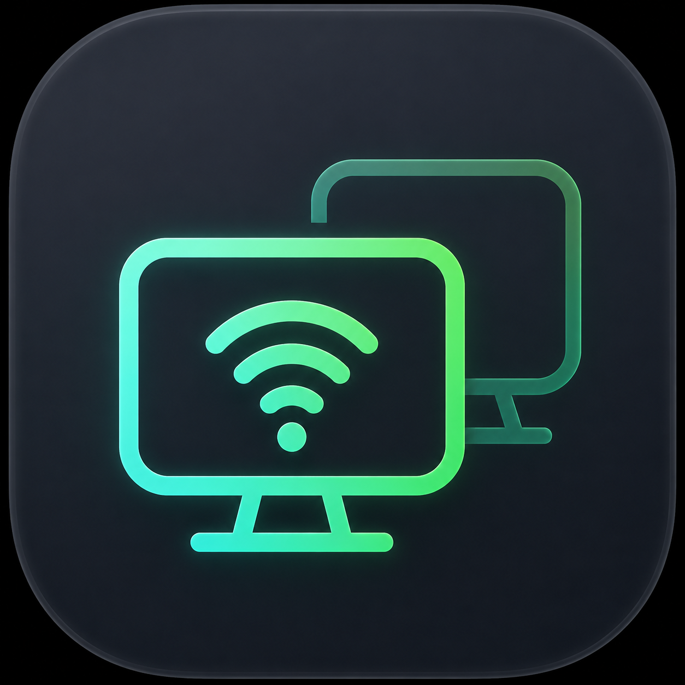

<p align="center">
  
</p>

<h1 align="center">SameDesk</h1>

A macOS menu-bar app that turns your Mac into a **local-network remote desktop**.
It streams the screen to any modern web browser on the same WiFi/LAN and accepts
full keyboard / mouse / clipboard control back — over an **authenticated HTTPS +
WebSocket** endpoint secured with a locally-trusted [mkcert] certificate.

It runs **headless** (menu-bar only, no main window), captures with
**ScreenCaptureKit**, encodes **H.264** with **VideoToolbox**, muxes to
**fragmented MP4** on the fly, and is hardened against accidental
internet-exposure (LAN IPv4 only, never any UPnP/NAT-PMP mapping).

> **LAN-only by design.** No relay, no public-internet mode, single display.

---

## Features

- **Screen streaming** to any modern browser on the LAN — no app to install on
  the client.
- **Full control back**: keyboard (physical `event.code`), mouse, scroll,
  pinch-to-zoom, and two-way **clipboard** sync.
- **Low-latency video**: WebCodecs decode to `<canvas>` by default, MSE fallback;
  optional **HEVC/H.265** for ~2× compression, with automatic H.264 fallback.
- **System audio** streaming (optional), played via the Web Audio API.
- **Adaptive bitrate** (RTT-driven) and **delta encoding** that drops an idle
  screen to near-zero bandwidth.
- **In-page HUD** with FPS, bitrate, RTT, glass-to-glass latency, and a CSV export
  of the last five minutes.
- **Headless / virtual display** when no monitor is attached.
- **Secure by construction**: Keychain access token, mkcert HTTPS/WSS, LAN-IPv4
  binding only, and no UPnP/NAT-PMP mapping.

---

## Install

### Homebrew (recommended)

```sh
brew install --cask dsaad68/tap/samedesk
```

Installs `SameDesk.app` to `/Applications`. SameDesk is a menu-bar app (no Dock
icon); on first launch grant it **Screen Recording** and **Accessibility** in
System Settings → Privacy & Security, and install `mkcert` (see
[Requirements](#requirements)).

> Apple Silicon, macOS 14+. The build is ad-hoc signed (not notarized); the cask
> clears the quarantine flag for you. If macOS still blocks it, right-click the
> app → **Open** once.

### Download

Grab `SameDesk-macos-arm64.zip` from the [latest release][releases], unzip, and
move `SameDesk.app` to `/Applications`.

### Build from source

See [Build & run](#build--run) below, then run `./scripts/make-app.sh` to wrap
the binary into `SameDesk.app` (details in [`packaging/`](packaging/README.md)).
The app icon is authored in Icon Composer (`docs/icon.icon`); regenerate the
bundle assets with `./scripts/make-icon.sh` after editing it.

[releases]: https://github.com/dsaad68/SameDesk/releases

---

## Requirements

- **macOS 14+** (Sonoma) — the deployment target is pinned to 14.0.
- **Apple Silicon** (primary target).
- **App Sandbox is DISABLED** — required for `CGEvent` injection on the
  `.cghidEventTap`. Do not re-enable hardened-runtime restrictions that block
  event posting.
- [`mkcert`](https://github.com/FiloSottile/mkcert) installed
  (`brew install mkcert`) and `mkcert -install` run once on the Mac **and on
  each client device**.

## Build & run

```sh
swift build -c release
.build/release/SameDesk
```

(Or open `Package.swift` in Xcode.) On first launch SameDesk:

1. Requests **Screen Recording** and **Accessibility** permissions.
2. Generates an access token (stored in the **Keychain**).
3. Mints a TLS leaf cert via `mkcert` with SANs for the LAN IPv4, the Mac's
   real Bonjour `.local` hostname, and `samedesk.local`.
4. Starts the listener bound to your **LAN IPv4 interface only**.
5. Writes a setup/security checklist to
   `~/Library/Application Support/SameDesk/SameDesk-SETUP.md` and opens it.

Use the menu-bar **Copy URL** (or **AirDrop URL…**) item to get a tokenized
`https://<lan-ipv4>:8080/?token=…` link, then open it on another LAN device.
Because SameDesk binds **IPv4-only** (a security requirement), the LAN IPv4 is
the canonical address. The **Settings** window also offers a **.local URL** for
the Mac's real Bonjour hostname, but note a `.local` name resolves to *both* IPv4
and IPv6 and browsers prefer IPv6 (Happy Eyeballs) — so the `.local` name only
works on a LAN without IPv6. The cert covers the IP, the `.local` name, and
`samedesk.local`.

The full menu is: status line, **Copy URL**, **AirDrop URL…** (when available),
**Settings…** (⌘,), **Start/Stop Server**, and **Quit** (⌘Q).

### Stopping the Keychain prompt on every rebuild

The access token lives in the Keychain, and macOS ties a Keychain item's
"Always Allow" permission to the app's **code-signing identity**. An unsigned
`swift build` binary is identified by its hash, which changes every build — so
the Keychain re-prompts after each rebuild (clicking **Always Allow** only lasts
until the next build; running the *same* binary again won't re-prompt).

To make it stick, sign every build with a **stable identity**:

```sh
SAMEDESK_SIGN_ID="Apple Development: you@example.com" ./scripts/dev-build.sh
```

Click **Always Allow** once and future builds signed with the same identity are
trusted silently. No Apple certificate? Create a self-signed one in **Keychain
Access ▸ Certificate Assistant ▸ Create a Certificate… ▸ Code Signing** and pass
its name as `SAMEDESK_SIGN_ID`.

## Releases

See [`CHANGELOG.md`](CHANGELOG.md) for the version history. A GitHub Release is
published automatically whenever `main` is updated to a version that doesn't yet
have a tag: the [release workflow](.github/workflows/release.yml) reads the top
`## [x.y.z]` entry of `CHANGELOG.md` for the tag and notes, builds the release
binary, and attaches `SameDesk-macos-arm64.zip` (the executable plus its resource
bundle). To cut a release, add a new changelog entry at the top and merge to
`main`.

## Architecture

```
ScreenCaptureKit ──► H264Encoder (VideoToolbox) ──► FMP4Muxer ──► Broadcaster ──► WebSocket ──► Browser (MSE)
   (dirty-rect           (real-time, High/auto,        (ftyp/moov         (per-client
    gating)               no B-frames)                  + moof/mdat)        drop-oldest queues)
```

| Area | File |
|------|------|
| Entry / app lifecycle | `Sources/SameDesk/main.swift`, `AppDelegate.swift`, `AppCoordinator.swift` |
| Menu-bar UI | `MenuBarController.swift` |
| Security: token (Keychain, constant-time) | `Security/TokenStore.swift` |
| Security: mkcert TLS | `Security/CertificateManager.swift` |
| Security: LAN-only pre-flight, `getifaddrs` | `Security/NetworkLockdown.swift` |
| Resolvable `.local` hostname | `Security/Hostname.swift` |
| Capture (dirty-rect / delta gating) | `Capture/ScreenCapturer.swift` |
| H.264 encode | `Encode/H264Encoder.swift` |
| Hand-rolled fMP4 muxer | `Encode/FMP4Muxer.swift` |
| HTTPS + WSS server (Hummingbird) | `Server/SameDeskServer.swift` |
| Per-client broadcast | `Server/Broadcaster.swift` |
| Wire protocol (JSON) | `Server/Protocol.swift` |
| Input injection (`CGEvent`) | `Input/InputController.swift`, `Input/KeyMap.swift` |
| Clipboard sync | `Clipboard/ClipboardSync.swift` |
| Virtual display (private API) | `VirtualDisplay/VirtualDisplayManager.swift` |
| Browser client (static HTML/JS) | `Client/client.html`, `Client/client.js`, `Client/ClientAssets.swift` |

### Concurrency

Only genuinely shared mutable state is synchronized: the connected-client list
and init-segment cache live in the `Broadcaster` **actor**, the current clipboard
value behind a lock. The **60 fps capture/encode hot path is not funnelled
through a single actor** — `VTCompressionSessionEncodeFrame` is called
synchronously from the `SCStreamOutput` callback, finished NAL units flow through
a single ordered consumer task into the broadcaster, and each client has its own
bounded outbound queue.

## Security model

### Authentication
- ≥ 32-byte base64url token, persisted in the **Keychain**, regenerable from the
  menu.
- **Every** entry point requires it: `GET /` returns **401** without a valid
  token; the `/ws` upgrade is **refused** on mismatch.
- Tokens are compared in **constant time** (no early-out on first mismatch).

### TLS via mkcert
- HTTPS + WSS only (no plain HTTP). The leaf cert's SANs cover the LAN IPv4, the
  Mac's real Bonjour `.local` hostname, and `samedesk.local`. The IP is the
  canonical connect address (we bind IPv4-only); the `.local` name is offered as
  an alternative for IPv6-free LANs and survives DHCP changes.
- **Each client device must run `mkcert -install` once.** On iOS you must also
  enable trust under *Settings → General → About → Certificate Trust Settings*.

### Network lockdown
- Binds **only** the chosen LAN IPv4 interface address — never `0.0.0.0`, never
  `::`/IPv6 — so a permissive router IPv6 firewall can't expose it.
- **Never** requests a UPnP IGD / NAT-PMP / PCP mapping. (There is no
  port-mapping code in this app, by design.)
- A **startup pre-flight** verifies the bind address is a private LAN IPv4 and
  **refuses to start** otherwise, surfacing
  *"Listening on LAN IPv4 only — not internet-exposed"* in the menu.
- See `SameDesk-SETUP.md` for the user-side checklist (disable router UPnP,
  confirm inbound IPv6 firewall closed, remove stale forwards, mind overlay VPNs
  like Tailscale).

## Notes on the corrected requirements

A few items in the build spec were corrected because the literal version is
broken; the implemented behavior is:

- **H.264 profile:** High / auto-level (`avc1.640033`-class), not Baseline 3.0
  (which caps at ~720p and would break on normal Mac displays).
- **HEVC/H.265 option (menu toggle):** encodes HEVC (Main, auto-level) for ~2×
  compression — a sharper image at the same bitrate. The muxer emits an
  `hvc1`/`hvcC` sample entry; the client decodes via WebCodecs (Safari 17+,
  Chrome/Edge with hardware HEVC). Falls back to H.264 automatically if the Mac
  can't encode HEVC, and the init segment is self-describing so the client
  adapts (`hvcC` ⇒ HEVC, `avcC` ⇒ H.264).
- **WebCodecs video path (default):** the client demuxes our fMP4 fragments to
  raw NAL units and decodes via `VideoDecoder` to a `<canvas>` — lowest latency,
  no MSE buffering. Falls back to MSE when WebCodecs/the codec isn't supported.
- **Audio (menu toggle, default off):** ScreenCaptureKit system-audio capture,
  sent as interleaved Float32 PCM over the WebSocket (tagged binary frames) and
  played via the Web Audio API. Browsers block audio until a user gesture, so
  the client's audio context resumes on first interaction.
- **Separate input channel:** input/clipboard/ping ride their own `/input`
  WebSocket, distinct from the `/ws` video socket, so clicks/keys never queue
  behind video frames (TCP is one ordered stream) and the measured RTT reflects
  true input latency.
- **Transport note:** video rides the WebSocket (TCP). True UDP-style transport
  (WebTransport/WebRTC) would cut latency further but needs an HTTP/3 stack that
  has no production-ready Swift implementation yet — tracked as future work.
- **MSE needs fMP4**, not raw NAL units — hence the hand-rolled `FMP4Muxer`
  (`ftyp`+`moov` init segment from the SPS/PPS, then `moof`+`mdat` fragments).
  The video path is kept modular so MSE↔WebCodecs is a localized swap.
- **"Delta encoding"** = skip frames whose `dirtyRects` is empty, and let H.264
  P-frames encode only the changed macroblocks. (H.264 cannot encode arbitrary
  changed sub-rectangles like VNC/RFB.)
- **Keyboard:** sends physical `event.code` (mapped to `CGKeyCode`), not the
  deprecated/layout-dependent `keyCode`; sends keydown **and** keyup; routes
  printable/IME text through Unicode injection.
- **Pinch-to-zoom:** mapped to Cmd+scroll (no public magnify-gesture
  `CGEvent` API exists).
- **Shortcut passthrough:** client-side **Keyboard Lock API** in fullscreen
  (available on the mkcert secure context), injected server-side as normal
  `CGEvent`s.
- **Virtual display:** uses the **private** `CGVirtualDisplay` API, detected at
  runtime and falling back gracefully if unavailable.

## Non-goals

No multi-monitor, no reconnection logic beyond the browser's native
WebSocket behavior, no public-internet/relay mode.

[mkcert]: https://github.com/FiloSottile/mkcert
